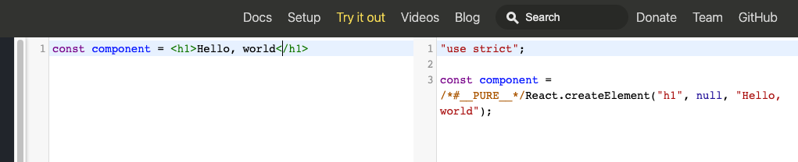
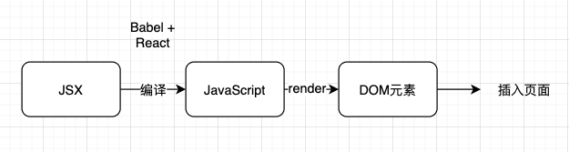

---
nav:
  title: 基础
  path: /base
group:
  title: 基础特性
  order: 1
title: JSX
order: 2
---

# JSX

**JSX**一个 JavaScript 的语法扩展。我们建议在 React 中配合使用 JSX，JSX 可以很好地描述 UI 应该呈现出它应有交互的本质形式。JSX 可能会使人联想到模板语言，但它具有 JavaScript 的全部功能。

React 中 JSX 实质上构建的是一个抽象的视图层。JSX 本身无法被游览器解析执行，需要通过`babel`编译，以及 React 内部的执行，显示到各个终端。

JSX 实质上是`React.createElement(component, props, ...children)`的语法糖。



引入的原因是为了更好的编写**视图层**。

## 原理

每个 DOM 元素的结构都可以`JavaScript`的对象来表示。也就是前面提到的虚拟 DOM(`virtual Dom`)。我们可以看一下 DOM 的基本信息

- 标签`tagName`
- 属性`props`
- 子元素`children`

```json
{
  "tagName": "",
  "props": {},
  "children": []
}
```

我们可以使用`JavaScript`描述视图层，React 使用`JSX`让我们更低成本的编写页面。编译的过程会将`JSX`转成`JS`的对象结构类型。

实质上`JSX`最终会变渲染成`React.createElement`



## 元素类型

### 对应规则

- DOM 元素对应小写
- React 组件对应大写

```html
<div>hello, world</div>

<Foo>Hello, World</Foo>
```

## 元素属性

组件中，你可以自定义一些元素属性，也可理解为实现组件所需要的参数。

在 React，中，所有的 DOM 特性和属性都是用**小驼峰命名法**。

⚠️ 注意：我们使用双引号进行传递的属性，实际在到最后接受到的类型都会是字符串。

### 属性表达式

当我们想传递变量给属性时，我们需要使用的是`{}`语法，如下图

```html
<CheckBox value={"hug"} />
```

### 特殊属性

#### checked

- 受控组件: `checked`
- 非受控组件: `defaultChecked`

#### className

相当于 html 中的`class`，为常规的 DOM 节点指定类。

#### dangerouslySetInnerHTML

用于替换游览器中`innerHTML`的函数。

#### htmlFor

替代 html 中的`for`

### 自定义属性

虽然 React 组件元素采取小驼峰命名法，但`aria-`和`data-`还是例外的。

JSX 往原生 DOM 插入属性，是不生效的。

### 字符串转义

React 会讲显示 DOM 的字符串转义，防止 XSS 攻击。

---

## Q&A

- 为什么`React`中，`JSX`的文件中需要引入`React` ?

  答：`JSX`会被`babel`编译,写的`JSX`会被编译成`React.createElement`.

-

**参考资料**

- [JSX](https://tsejx.github.io/react-guidebook/foundation/main-concepts/jsx)
