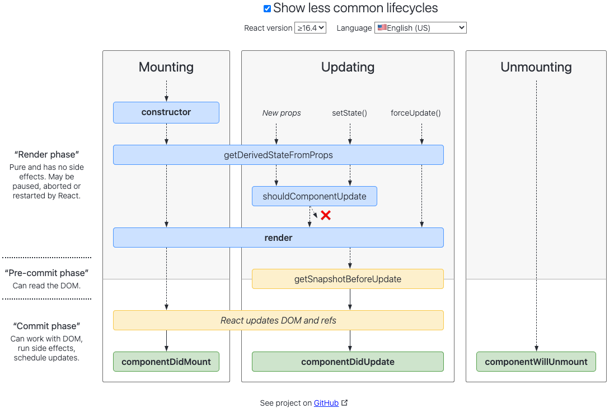

---
nav:
  title: 基础
  path: /base
group:
  title: 基础特性
  order:
title: 生命周期
order: 6
---

# 生命周期

生命周期指 React 从装载到卸载的全过程，这个过程内置多个函数供开发者在组件的不同阶段执行需要的逻辑，会触发不同的生命周期钩子。（本文基于 React version 版本大于 16.4 为准）

- **装载阶段 Mounting**
  - `constructor`
  - `static getDerivedStateFromProps`
  - `render`
  - `componentDidMount`
- **更新阶段 Updating**
  - `static getDerivedStateFromProps`
  - `shouuldComponentUpdate`
  - `render`
  - `getSnapshotBeforeUpdate`
  - `componentDidUpdate`
- **卸载阶段 Unmounting**
  - `componentWillUnmount`
- **捕捉错误 Error Handling**
  - `static getDerivedStateFromError

状态组件主要通过 3 个生命周期管理，分别是`mounting`,`updating`,`unmount`

从纵向划分，可以分为`Render`和`commit`阶段

- Render 阶段：纯净且不包含副作用，可能会被 React 暂停、中止或重新启动
- Commit 阶段：可以使用 DOM，运行副作用，安排更新

更清晰了解生命周期的阶段图表 [React Lifecycle Methods Diagram](http://projects.wojtekmaj.pl/react-lifecycle-methods-diagram/)



## MOUTING 阶段

组件的渲染并构造 DOM 元素插入页面的过程叫做组件的**装载**。

装载阶段执行的函数会在组件实例被**创建**和**插入** DOM 中时被触发，这个过程主要实现**组件状态的初始化**。

### constructor

**语法**：`constructor(props, context, updater)`

- `props`: 继承 React.Component 的属性，是不可变的 read-only
- `context`:全局上下文
- `updater`:包含更新方法的对象
  - `this.setState` 最终调用的是 `this.updater.enqueueSetState`
  - `this.forceUpdate` 最终调用的是 `this.updater.enqueueForceUpdate` 方法，所以这些 API 更多是 React 调用使用，暴露出来以备开发者不时之需。

**触发时间**：组件初始化的时候触发一次。

**使用建议**：

- 设置初始化状态：因为组件的生命周期中任何函数都可能要访问 State，那么整个周期中第一个被调用的构造函数便是初始化 `state` 最理想的地方；
- 绑定成员函数上下文引用：
  - 因为在 ES6 语法下，类的每个成员函数在执行时的 `this` 并不是和类实例自动绑定的；
  - 而在构造函数中 `this` 就是当前组件实例，所以，为了方便将来调用，往往在构造函数中将这个实例的特定函数绑定 `this` 为当前类实例；
  - 建议定义函数方法时直接使用箭头函数，就无须在构造函数中进行函数的 `bind` 操作。

在 ES6 中，在构造函数中通过 `this.state` 赋值完成状态初始化；通过给类属性（注意是类属性，而不是类实例对象的属性）`defaultProps` 赋值指定的 `props` 初始值

```ts
class Sample extends React.Component {
  constructor(props, context, updater) {
    super(props);
    this.state = {
      foo: 'InitailValue',
    };
  }
}

Sample.defaultProps = {
  bar: 'InitialValue',
};
```

### static getDerivedStateFromProps

**语法：**`static getDerivedStateFromProps(nextProps, prevState)`

**触发时机**：该函数在组件实例化和组件重新渲染前调用（生成 vdom 之后，但在挂载之前）。意味着无论是父组件的更新、`props` 的变化或通过 `setState` 更新组件内部的 State，它都会被调用。

**返回值**：该生命周期函数必须有返回值，它需要返回一个对象来更新 State，或者返回 `null` 来表明新 `props` 不需要更新任何 `state`。

**特性**：当组件实例化时，该方法替代了 `componentWillMount`，而当接收新的 `props` 时，该方法替代了 `componentWillReceiveProps` 和 `componentWillUpdate。`

**注意事项：**

- 组件装载和更新的时候都会触发
- 如果你只想处理 `props` 的前后变化，你需要将上一个 `props` 值存到 `state` 里作为镜像；

- 该生命周期函数是一个**静态函数**，所以函数体内无法访问指向当前组件实例的指针 `this`；
- 当需要更新 `state` 时，需要返回一个对象，否则，返回一个 `null`

> 🖍 为什么该生命周期函数要设计成静态方法呢？

1. 保证方法的纯粹性。
2. 不让开发者通过 this 访问到当前的实例。

### UNSAFE_componentWillMount

**预装载函数**。

⏱ **触发时机**：在构造函数和装载组件（将 DOM 树渲染到浏览器中）之间触发。装载组件后将执行 `render` 渲染函数。因此在此生命周期函数里使用 `setState` 同步设置组件内部状态 `state` 将不会触发重新渲染。

⚠️ **注意事项**：避免在该方法中引入任何的副作用（Effects）或订阅（Subscription）。对于这些使用场景，建议提前到构造函数中。

### render

**渲染函数**

🔙 返回值：唯一的一定不能省略的函数，而且必须有返回值。返回 `null` 或 `false` 表示不渲染任何 DOM 元素。

当触发时，其应该检查 `this.props` 和 `this.state` 并返回以下类型之一：

- **React 元素**：通常是由 JSX 创建。该元素可能是一个原生 DOM 组件的表示，如 `<div />`，或者是一个你定义的合成组件。
- **数组和片段**：让你返回多个元素的片段（Fragment）。
- **字符串和数字**：这些将被渲染为 DOM 中的文本节点（Text Node）。
- **Protals**：由 [`ReactDOM.createPortal`](http://react.yubolun.com/docs/portals.html) 创建。
- **布尔值** 和 `null`：什么都不渲染（通常存在于 `return isVisible && <Child />` 写法，其中 `isVisible` 是布尔值。）

**注意**：render 要保证是用于**渲染**的**纯函数**。返回值取决于`props`和`state`，不能在其中添加有副作用的操作。不能读写 DOM 信息，也不能和浏览器进行交互（例如 `setTimeout`）。如果需要和浏览器交互，在 `componentDidMount()` 中或者其它生命周期方法完成相关事务。

此函数并不做真正的**渲染**。而是返回 JSX 对象，渲染逻辑取决于 React。而 React 肯定是要把所有组件返回的结果综合起来，才能知道如何产生真实的 DOM 树。也就是说，只有 React 库调用所有组件的渲染函数之后，才有可能完成 DOM 装载，这时候才会依次调用 `componentDidMount` 函数作为装载的收尾。

保持 `render()` 纯粹，可以使服务器端渲染更加切实可行，也使组件更容易被理解。

注意事项：

- 勿在 render 使用`setState`方法
- 请勿在此函数中修改 `props`、`state` 以及数据请求等具有副作用的操作。

### componentDidMount

**触发时机：**组件挂载到网页节点触发。

**适用场景**：发起请求；任何依赖于 DOM 的初始化操作；添加事件监听；如果使用了 Redux 之类的数据管理工具，也能触发 action 处理数据变化逻辑。

**注意**：

1. 该生命周期在服务端不会生效（SSR）
2. 不是在 render 完成后立即触发，中间还有一个挂载的过程，只有当组件被挂载到了 DOM 元素上才会触发。

**使用建议**

- 用于发起**网络请求**。
- 此时 DOM 节点已经渲染出来了，可以**初始化 DOM 节点的操作**。
- 定时器的操作。
- 此钩子函数中允许使用 setState 改变组件内 State。

## 更新阶段

属性（props）和状态（state）的改变，都会触发一次更新阶段，但组件的渲染需要取决于`shouldComponentUpdate`

### UNSAFE_componentWillReceiveProps

**语法**：`UNSAFE_componentWillReceiveProps(nextProps)`

**触发时机**：当父组件的渲染函数被调用，在渲染函数中被渲染的子组件就会经历更新阶段，不管父组件传给子组件的 `props` 有没有改变，都会触发该生命周期函数。当组件内部调用 `setState` 更新内部状态 `state` 时触发更新阶段不会触发该函数。

**适用场景**：适合用于父子组件之间的联动，适合父组件根据某个状态控制子组件的渲染或者销毁。通过对比 `this.props` 和 `nextProps` 来对本组件内的 `state` 进行变更，或执行某些方法来进行组件的重新渲染。

**使用建议**：在该回调函数中，可以根据属性的变化，通过调用 `this.setState()` 来更新组件状态。通过参数 `nextProps` 获取新的 `props` 值，而旧的属性可以通过 `this.props` 获取，基于状态变化前后的 `props` 对比的结果去实现不同的行为，避免不必要的渲染。这里进行状态更新是安全的，并不会触发额外的 `render` 。

**注意**：该生命周期函数需要提供条件跳出，因为更新内部状态 `state` 的方法是 `this.setState()` ，如果 `this.setState()` 的调用导致 `componentWillReceiveProps` 再调用，那将是一个死循环。

### shouldComponentUpdate

**语法**：`shouldComponentUpdate(nextProps, nextState)`

**触发时机**：每次组件的`stete`和`props`变化而更新，在**重新渲染前**该生命周期函数都会触发，让 React 知道当前 `state` 或 `props` 的改变是否影响组件的输出（渲染）。

**返回值**：布尔值。根据逻辑判断返回 `true` 表示继续进行组件渲染，否则将停止组件渲染过程。默认返回 `true`，也就是说，只要组件触发了更新，组件就一定会更新。在一个更新生命周期中，组件及其子组件将根据该方法返回的布尔值来决定是否继续这次更新过程（重新渲染）。这样你可以在必要的时候阻止组件的渲染生命周期（Render Lifecycle）方法，避免不必要的渲染。

默认情况下，该方法默认返回 `true`，表示需要重新渲染，在大部分情况下你应该依赖于默认行为。如果在 `state` 改变的时候为了避免细微的 Bug，或是如果总是把 `state` 当做不可变的，在 `render()` 中只从 `props` 和 `state` 读取值，此时你可以覆盖该方法，实现新老 `props` 和 `state` 的比对逻辑。

当该方法返回的布尔值 `false` 告知 React 无须重新渲染时，`render`、`UNSAFE_componentWillUpdate` 和 `componentDidUpdate` 等生命周期钩子函数都不会被触发。

**使用建议**：

- 如果性能是个瓶颈，尤其是有几十个甚至上百个组件的时候，使用 `shouldComponentUpdate` 可以优化渲染效率，提升应用的性能；
- 使用 `React.PureComponent` 组件基类能自动实现一个 `shouldComponentUpdate` 生命周期钩子，可以默认为组件更新校验，但是只会对更新数据进行浅层对照；
- 在对 `this.props` 和 `nextProps` 以及 `this.state` 和 `nextState` 进行比较时需要注意引用类型的坑；
- 通常用于条件渲染，优化渲染的性能。

**注意事项**：

- 此钩子函数在初始化渲染和使用了 `forceUpdate` 方法的情况下不会被触发，使用 `forceUpdate` 会强制更新
- 请勿在此函数中使用 `setState` 方法，会导致循环调用。

### UNSAFE_componentWillUpdate

> 🗑 此生命周期函数将在 React v17 正式废弃。

**预更新函数**。

📜 **语法**：`UNSAFE_componentWillUpdate(nextProps, nextState)`

⏱ **触发时机**：这个方法是一个更新生命周期中重新渲染执行之前的最后一个方法。你已经拥有了下一个属性和状态，他们可以在这个方法中任由你处置。你可以利用这个方法在渲染之前进行最后的准备。

🎉 **适用场景**：根据 `state` 的 变化设置变量；派发事件；开始动画。

⚠️ **注意事项**：

- 此钩子函数在初始化渲染的时候不会被触发；
- 请勿在此函数中使用 `setState` 方法，会导致循环调用。如果需要基于新的 `props` 计算 State，建议使用 `componentWillRreceiveProps`。

### render

渲染函数。与上文所提及的 `render` 生命周期函数一致，用于输出 JSX 并经过 React 处理后渲染至浏览器。

### getSnapshotBeforeUpdate

**保存状态快照。**

📜 **语法**：`getSnapshotBeforeUpdate(prevProps, prevState)`

⏱ **触发时机**：该生命周期函数会在组件即将挂载时触发，它的触发在 `render` 渲染函数之后。由此可见，`render` 函数并没有完成挂载操作，而是进行构建抽象 UI（也就是 Virtual DOM）的工作。该生命周期函数执行完毕后就会立即触发 `componentDidUpdate` 生命周期钩子。

🎉 **适用场景**：该生命周期函数能让你捕获某些从 DOM 中才能获取的（可能会变更的）信息（例如，元素重新渲染后页面各种定位位置的变更等）。

作用：比如网页滚动位置，不需要它持久化，只需要在组件更新以后能够恢复原来的位置即可。

⚠️ **注意事项**：

- 该生命周期函数返回的值将作为第三个参数传递给 `componentDidUpdate`，我们可以利用这个通道保存一些不需要持久化的状态，用完即可舍弃。（这个生命周期不是经常需要的，但可以用于在恢复期间手动保存滚动位置的情况。）
- 该函数的出现是为了 React 17 的异步渲染而准备的

⚠️ 与 `componentDidUpdate` 一起，这个新的生命周期将覆盖旧版 `componentWillUpdate` 的所有用例。

```js
getSnapshotBeforeUpdate(prevProps, prevState) {
    console.log('#enter getSnapshotBeforeUpdate');
    return 'foo';
}


componentDidUpdate(prevProps, prevState, snapshot) {
    console.log('#enter componentDidUpdate snapshot = ', snapshot);
}
```

### componentDidUpdate

**更新完成函数**。

📜 **语法**：`componentDidUpdate(nextProps, nextState, snapshot)`

⏱ **触发时机**：组件每次重新渲染后触发，相当于首次渲染（初始化）之后触发 `componentDidMount` ，

🎉 **适用场景**：操作 DOM；发送网络请求。

⚠️ **注意事项**：

- 将原先写在 componentWilUpdate 中的回调迁移至 componentDidUpdate，将以前放在 componentWillReceiveProps 中的异步网络请求放在 componentDidUpdate 中。
- 在该生命周期中使用 `setState` 时，必须加 if 条件判断，通过判断 prevProps、prevState 和 this.state 之间的数据变化，来判断是否执行相关的 `state` 变更逻辑，这使得尽管在 componentDidUpdate 中调用了 setState 进行再更新，但是直至条件不成立，就不会造成程序死循环。
- 此生命周期函数不会在初始化渲染的时候触发。

相比装载阶段的生命周期函数，更新阶段的生命周期函数使用的相对来说要少一些。常用的是 `getDerivedStateFromProps`、`shouldComponentUpdate`，前者经常用于根据新 `props` 的数据去设置组件的 State，而后者则是常用于优化，避免不必要的渲染。

```js
componentDidUpdate(prevProps){
    if (this.props.id !== prevProps.id){
        this.fetchData(this.props.id);
    }
}
```

## 卸载阶段

### componentWillUnmount

**预卸载函数**。

⏱ **触发时机**：在组件卸载和销毁之前触发。可以利用这个生命周期方法去**执行任何清理任务**。

🎉 **适用场景**：用于注销事件监听器；取消网络请求；取消定时器；解绑 DOM 事件。

⚠️ **注意事项**：在该方法中调用 `setState` 不会触发 `render`，因为所有的更新队列，更新状态都被重置为 `null`。

---

**参考资料**

- [生命周期](https://tsejx.github.io/react-guidebook/foundation/main-concepts/lifecycle)
