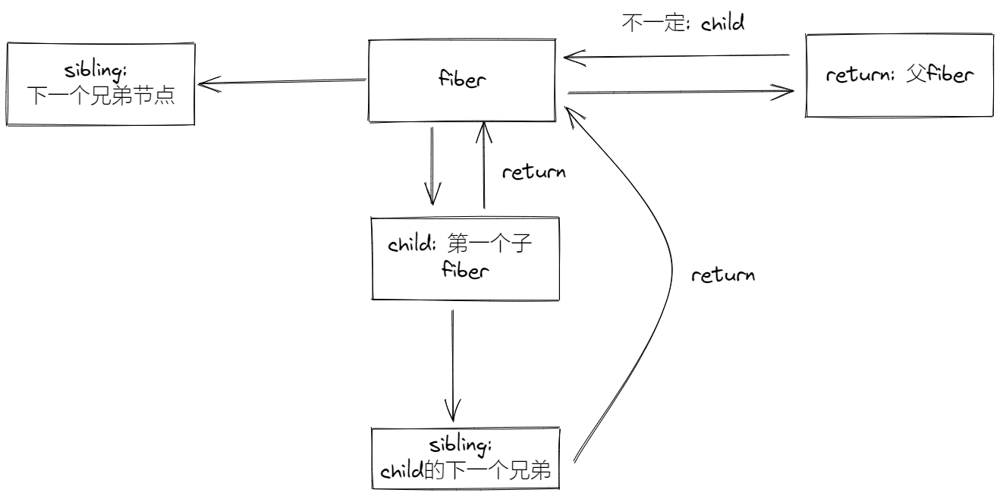

---
nav:
  title: mini-react
  path: /mini-react
group:
  title: 基础
  order: 2
title: fiber
order: 2
---

# Fiber

## 设计思想

`Fiber` 是对 `React` 核心算法的重构，`facebook` 团队使用两年多的时间去重构 `React` 的核心算法，在`React16` 以上的版本中引入了 `Fiber` 架构，其中的设计思想是非常值得我们学习的。

通过 `Fiber` 架构，让 `reconcilation` 过程变得可被中断。适时地让出 `CPU` 执行权，可以让浏览器及时地响应用户的交互。

## 什么是 Fiber

### 一个执行单元

`Fiber`可以理解为一个执行单元，每次执行完一个执行单元，react 就会检查现在还剩多少时间，如果没有时间则将控制权让出去。

`Fiber` 可以被理解为划分一个个更小的执行单元，它是把一个大任务拆分为了很多个小块任务，一个小块任务的执行必须是一次完成的，不能出现暂停，但是一个小块任务执行完后可以移交控制权给浏览器去响应用户，从而不用像之前一样要等那个大任务一直执行完成再去响应用户。

### 一种数据结构

`Fiber` 可以理解为一种数据结构， `React Fiber` 采用链表结构。每一个 `Virtual DOM` 都可以表示为一个 `fiber`。 一个 `fiber` 包括了 `child`（第一个子节点）、`sibling`（兄弟节点）、`return`（父节点）等属性。

